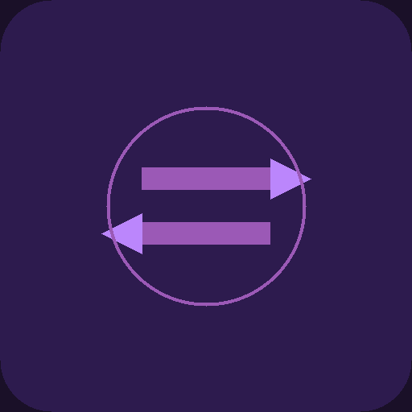

<p align="center">
  
</p>

<h1 align="center">ZenTransfer</h1>

<p align="center">
  <strong>Cross‑platform file transfer, clipboard sync & notification mirroring</strong><br>
  Android ↔ Windows — zero cloud, all LAN.
</p>

<p align="center">
  <a href="LICENSE"></a>
  
  
  
</p>

---

## ✨ Features

| Feature | Android | Windows |
|---------|---------|---------|
| ⚡ **Peer discovery** — automatic LAN device detection | ✅ | ✅ |
| 📁 **File transfer** — send any file with streaming progress | ✅ | ✅ |
| 🔒 **Encryption** — AES‑256 end‑to‑end encrypted transfers | ✅ | ✅ |
| ✅ **Checksum verification** — SHA‑256 after every transfer | ✅ | ✅ |
| 🔁 **Auto‑retry** — resume interrupted transfers | ✅ | ✅ |
| ⭐ **Favorites** — trusted devices, one‑tap auto‑accept | ✅ | ✅ |
| 📋 **Clipboard sync** — copy on one device, paste on the other | ✅ | ✅ |
| 🔔 **Notification mirroring** — see phone notifications on PC | ❌ *(source)* | ✅ |
| 🖥️ **System tray** — stay connected even when window is closed | ❌ | ✅ |
| 🗂️ **Transfer history** — persistent log of sent & received files | ✅ | ✅ |
| 🏞️ **Thumbnail preview** — gallery thumbnails without loading full images | ✅ | ✅ |

---

## 🏗 Architecture

```
┌──────────────────────────────┐      ┌──────────────────────────────┐
│         Android              │      │          Windows             │
│                              │      │                              │
│  ┌────────────────────┐      │  TCP │  ┌────────────────────┐      │
│  │  LocalNetworkService│◄─────┼──────┼─►│  LocalNetworkService│      │
│  │  (stream decrypt)  │      │      │  │  (stream encrypt)  │      │
│  └────────────────────┘      │      │  └────────────────────┘      │
│  ┌────────────────────┐      │      │  ┌────────────────────┐      │
│  │  TransferProvider   │      │      │  │  TransferProvider   │      │
│  └────────────────────┘      │      │  └────────────────────┘      │
│  ┌────────────────────┐      │      │  ┌────────────────────┐      │
│  │  ClipboardService   │      │      │  │  ClipboardService   │      │
│  └────────────────────┘      │      │  └────────────────────┘      │
│  ┌────────────────────┐      │      │  ┌────────────────────┐      │
│  │  NotificationMirror │      │      │  │  NotificationMirror│      │
│  └────────────────────┘      │      │  └────────────────────┘      │
└──────────────────────────────┘      └──────────────────────────────┘
```

**Key design decisions:**
- **Stream‑based transfers** — large files never fully held in memory; decrypted chunk‑by‑chunk to disk, preventing OOM on low‑RAM devices
- **Encryption at rest** — each file is AES‑256 encrypted before leaving the sender; decrypted only after reaching the destination
- **Platform‑first architecture** — shared Dart core with platform‑specific modules for tray, clipboard, and notifications

---

## 📲 Installation

### Android
1. Download the latest APK from [Releases](https://github.com/Sugoi-ni/zen-transfer/releases)
2. Install: `adb install app-arm64-v8a-debug.apk`
3. Grant **Nearby devices** (Wi‑Fi scan) and **Notifications** permissions

### Windows
1. Download the latest release bundle
2. Run `zen_transfer.exe` — the tray icon appears in the system tray
3. First launch prompts firewall access — approve for LAN discovery

---

## 🔧 Development

```bash
# Clone
git clone https://github.com/Sugoi-ni/zen-transfer.git
cd zen_transfer

# Get dependencies
flutter pub get

# Run on Android
flutter run

# Run on Windows
flutter run -d windows

# Build APK
flutter build apk --debug --split-per-abi

# Build Windows release
flutter build windows --release
```

**Prerequisites:**
- Flutter SDK ≥ 3.11
- Dart SDK ≥ 3.11
- Windows build: Visual Studio 2022 with "Desktop development with C++"
- Android build: Android Studio / SDK 34+

---

## 🧪 Testing

```bash
# Analyze
flutter analyze

# Run tests
flutter test

# Build Android
flutter build apk --debug --split-per-abi
```

---

## 🚧 Roadmap

- [x] **Phase 1** — Core file transfer with encryption, retry, favorites, Windows tray
- [x] **Phase 2** — Clipboard sync + notification mirroring
- [ ] **Phase 3** — Android foreground service (always‑on receiver)
- [ ] **Phase 4** — iOS / macOS / Linux support
- [ ] **Phase 5** — Folder & multi‑file transfer

---

## 📸 Screenshots

<!-- Add screenshots here:
  | Device | View | File |
  |--------|------|------|
  | Android | Peer discovery | screenshots/android_discovery.png |
  | Android | Transfer progress | screenshots/android_transfer.png |
  | Windows | Tray + transfers | screenshots/windows_tray.png |
-->

> Screenshots coming soon. The current app is under active development.

---

## 📄 License

[MIT](LICENSE) — free to use, modify, and distribute.

---

<p align="center">
  Made with ❤️ by <a href="https://github.com/Sugoi-ni">Sugoi-ni</a>
</p>